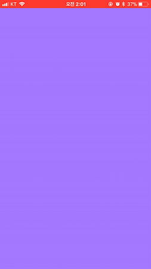

# TransitionAnimation
customizing transition animations

## Code Example
push , pop navigation controller

```
@objc func handlePanGesture(_ sender: UIScreenEdgePanGestureRecognizer){
        let location = sender.translation(in: view)
        let progress = location.x / self.view.frame.width
        switch sender.state {
        case .began:
            print("began")
            interactor.hasStarted = true
            let nextVC = UIStoryboard(name: "Main", bundle: nil).instantiateViewController(withIdentifier: "Second") as! DetailViewController
            nextVC.interactor = self.interactor
            nextVC.transitioningDelegate = nextVC
            self.present(nextVC, animated: true, completion: nil)
        case .changed:
            print("changed")
            interactor.shoudFinish = progress > 0.5
            interactor.update(progress)
        case .cancelled:
            print("cancelled")
            interactor.hasStarted = false
        case .ended:
            interactor.hasStarted = false
            interactor.shoudFinish ? interactor.finish() : interactor.cancel()
        default:
            print("default")
        }
    }
```

```
extension DetailViewController: UIViewControllerTransitioningDelegate {
    func animationController(forPresented presented: UIViewController, presenting: UIViewController, source: UIViewController) -> UIViewControllerAnimatedTransitioning? {
        return PresentAnimation()
    }
    
    func interactionControllerForPresentation(using animator: UIViewControllerAnimatedTransitioning) -> UIViewControllerInteractiveTransitioning? {
        return interactor?.hasStarted == true ? interactor : nil
    }
}
```


### Screen Gif


